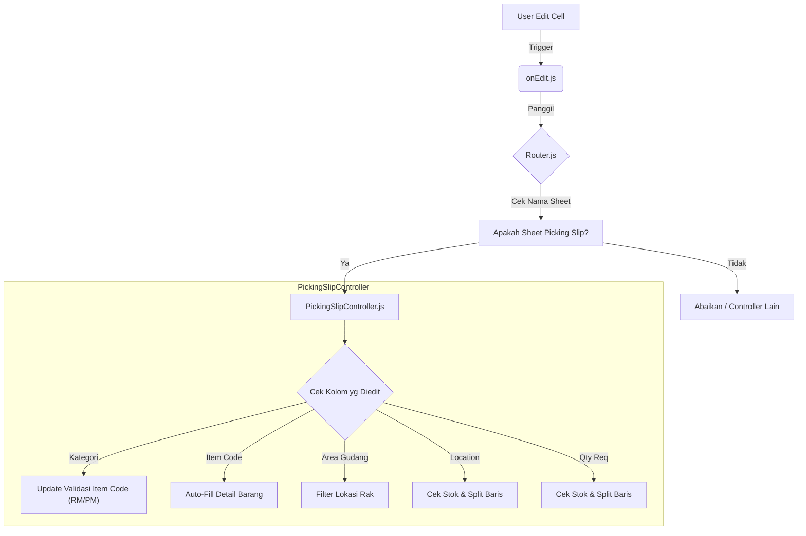
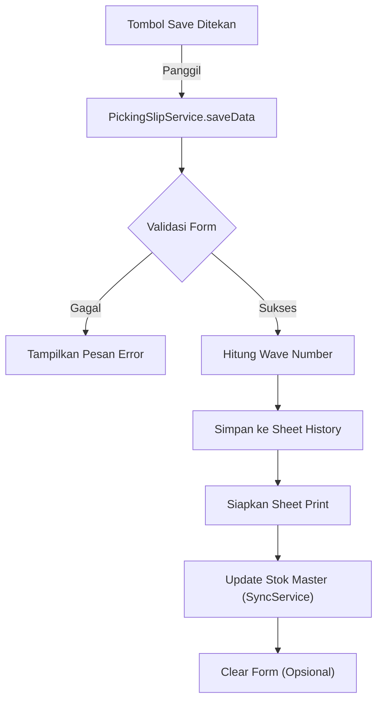

# Panduan Developer WMS (Warehouse Management System)

Dokumen ini ditujukan untuk developer atau administrator yang akan mengelola, merawat, dan mengembangkan script WMS ini. Script ini telah direfaktor menggunakan pola **Modular** untuk memudahkan pemeliharaan dan skalabilitas.

---

## 1. Arsitektur & Struktur Folder

Project ini tidak lagi menggunakan satu file besar (`Code.gs`), melainkan dipecah menjadi beberapa folder logis di dalam `src/`.

```
e:/ADEV WMS/ps/
├── appsscript.json       # Manifest file (Timezone, Dependencies)
├── onEdit.js             # Entry Point utama untuk Trigger onEdit
├── PANDUAN_DEVELOPER.md  # Dokumen ini
└── src/
    ├── config/           # PUSAT KONFIGURASI (Edit di sini untuk maintenance harian)
    │   ├── Config.js     # ID Spreadsheet, Nama Sheet, Email, UI
    │   └── Schema.js     # Definisi Nama Kolom & Struktur Header
    ├── core/             # Logika Inti (Jantung sistem)
    │   ├── Router.js     # Mengarahkan event onEdit ke Controller yang tepat
    │   └── SheetHelper.js# Membaca kolom secara dinamis (Anti-Hardcode)
    ├── features/         # Logika Bisnis per Fitur
    │   ├── PickingSlip/  # Fitur Picking Slip
    │   │   ├── PickingSlipController.js # Menangani interaksi user (Edit cell)
    │   │   └── PickingSlipService.js    # Menangani tombol Save/Clear
    │   └── Shared/       # Fitur yang dipakai bersama
    │       ├── SyncService.js       # Sinkronisasi data (Update Data)
    │       └── ValidationService.js # Validasi & Formatting
    └── utils/            # Fungsi bantuan umum (Format tanggal, ID generator)
```

---

## 2. Alur Kerja Sistem (Diagram)

### A. Alur Trigger `onEdit` (Saat User Mengedit Cell)

Script ini menggunakan **Router** untuk mendeteksi sheet mana yang sedang diedit, lalu memanggil **Controller** yang sesuai.



### B. Alur Penyimpanan Data (`saveData`)



---

## 3. Cara Membaca & Mengubah Konfigurasi

Ini adalah bagian terpenting untuk maintenance rutin. Anda **TIDAK PERLU** mengubah kode logika jika hanya ingin mengganti ID Spreadsheet atau menambah kolom.

### A. Mengganti ID Spreadsheet atau Nama Sheet
Buka file: `src/config/Config.js`

```javascript
var Config = {
  // ...
  SSID: {
    MASTER_INVENTORY: "ID_SPREADSHEET_DISINI", // Ganti ID di sini
    // ...
  },
  SHEET_NAME: {
    MASTER_INVENTORY: "Master Inventory", // Ganti nama sheet di sini jika berubah
    // ...
  }
};
```

### B. Mengubah Posisi/Nama Kolom (Schema)
Script ini **DINAMIS**. Artinya, script tidak peduli kolom "Item Code" ada di kolom A, B, atau Z. Script mencari kolom berdasarkan **NAMA HEADER**.

Jika Anda mengubah nama header di Google Sheet, Anda **HARUS** mengubahnya juga di `src/config/Schema.js`.

Buka file: `src/config/Schema.js`

```javascript
// Contoh: Schema untuk Master Inventory
HEADERS: [
    "Item Code", "Item Name", ... 
    // Pastikan nama ini PERSIS sama dengan di Google Sheet (Case Sensitive & Spasi)
],
COLUMNS: {
    ITEM_CODE: "Item Code", // Kunci internal : Nama Header di Sheet
    // ...
}
```

> **PENTING:** Jika Anda menambahkan kolom baru di tengah-tengah sheet, script TIDAK AKAN RUSAK, asalkan nama headernya terdaftar di Schema.

---

## 4. Penjelasan Detail Algoritma & Logika

### A. Pencarian Kolom Dinamis (`SheetHelper.js`)
Fungsi `getColumnIndex` bekerja dengan cara:
1.  Membaca baris header (biasanya baris 1 atau 7).
2.  Melakukan *looping* untuk mencari teks yang cocok dengan yang diminta.
3.  Mengembalikan nomor indeks kolom.
4.  Jika tidak ketemu, mengembalikan -1 (sehingga script bisa melakukan *safety check* dan tidak error).

### B. Logika FEFO & Filtering (`PickingSlipController.js`)
Saat user memilih Item Code:
1.  Script mengambil semua data dari Master Inventory.
2.  Melakukan filter:
    *   Item Code harus sama.
    *   Stok > 0.
    *   Jika Kategori = "RM", urutkan berdasarkan **Expiry Date** (Terlama ke Terbaru -> FEFO).
3.  Mengambil item pertama dari hasil filter untuk diisi ke form.

### C. Logika Split Row (Pemecahan Baris)
Saat user memasukkan `Qty Req` atau memilih `Location`:
1.  Script mengecek: Apakah `Qty Req` > `Sisa Stock` di lokasi tersebut?
2.  Jika **YA**:
    *   Isi `Qty Stock` di baris saat ini dengan stok maksimal yang ada.
    *   Hitung sisa kekurangan (`Req - Stock`).
    *   Cari batch/lokasi berikutnya yang tersedia (menggunakan logika FEFO yang sama).
    *   **Insert Row** baru di bawah baris saat ini.
    *   Isi baris baru dengan data batch berikutnya dan sisa `Qty Req`.
3.  Ini memastikan pengambilan barang selalu menghabiskan stok lama dulu sebelum pindah ke stok baru.

### D. Logika Wave Number (`PickingSlipService.js`)
Saat menyimpan:
1.  Script membaca Sheet History.
2.  Memfilter data berdasarkan **Tanggal Hari Ini**.
3.  Mengambil semua Timestamp unik.
4.  Menghitung jumlah Timestamp unik + 1 = **Wave Number**.
    *   Jadi, jika hari ini sudah ada 3 kali penyimpanan (3 wave), penyimpanan berikutnya adalah Wave 4.

---

## 5. Panduan Maintenance (Studi Kasus)

### Kasus 1: "Saya ingin menambahkan kolom 'Keterangan' di Form Picking Slip"
1.  **Di Google Sheet**: Tambahkan kolom "Keterangan" di header tabel.
2.  **Di Script (`src/config/Schema.js`)**:
    *   Cari bagian `FORM_PICKING_SLIP`.
    *   Tambahkan "Keterangan" ke dalam array `HEADERS`.
    *   Tambahkan mapping di `COLUMNS`: `KETERANGAN: "Keterangan"`.
3.  **Selesai**. (Kecuali Anda ingin kolom ini otomatis terisi atau divalidasi, baru edit Controller).

### Kasus 2: "Logic FEFO salah, harusnya FIFO berdasarkan Tanggal Masuk"
1.  Buka `src/features/PickingSlip/PickingSlipController.js`.
2.  Cari fungsi `data_filtered`.
3.  Ubah bagian `.sort()`:
    ```javascript
    // Ganti sorting Expiry Date dengan sorting Date In (misalnya)
    filtered.sort(function(a, b) {
        return new Date(a[mCols.DATE_IN]) - new Date(b[mCols.DATE_IN]);
    });
    ```

### Kasus 3: "Script error 'Column too small' atau data tidak muncul"
1.  Cek **Nama Header** di Google Sheet.
2.  Cek **Nama Header** di `src/config/Schema.js`.
3.  Pastikan keduanya sama persis (termasuk spasi). Contoh: "Batch/Lot" vs "Batch / Lot".

---

## 6. Tips Debugging
Jika terjadi error, script akan mencatatnya di sheet **Error Log** (sesuai konfigurasi di `Config.js`).
1.  Buka Sheet "Error Log".
2.  Lihat pesan error dan *stack trace*.
3.  Gunakan `Logger.log()` atau `console.log()` di script untuk melacak nilai variabel jika perlu debug lebih dalam.
